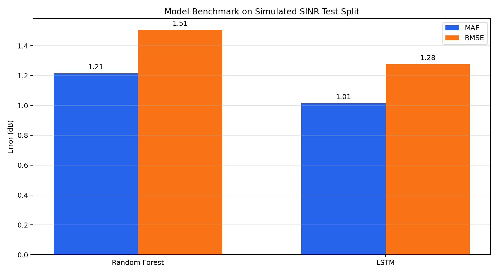
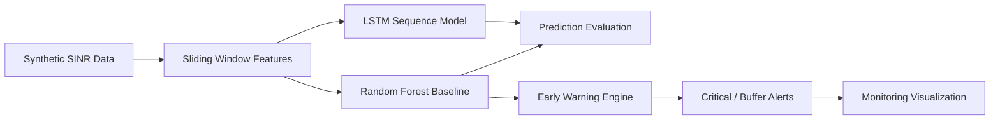

# Wireless Channel Prediction & Early Warning System

[](https://github.com/wtc2006/Channel_Prediction/actions/workflows/ci.yml)
[](LICENSE)
[](https://www.python.org/downloads/)
[](https://github.com/wtc2006/Channel_Prediction/releases)
[](https://pytorch.org/)

基于机器学习与深度学习的无线信道质量（SINR）预测与劣化预警系统。项目模拟路径损耗、阴影衰落、快衰落与突发劣化场景，并提供从数据生成、模型训练、效果评估、基准报告到智能预警的完整实验流水线。


## 项目亮点

- **完整流程**：覆盖数据模拟、随机森林基线、LSTM 序列建模、两级预警与可视化。
- **深度学习优化**：LSTM 使用训练集标准化和反标准化评估，默认实验中优于随机森林基线。
- **可复现实验**：统一随机种子、集中配置路径和超参数，方便复现实验结果。
- **双模型对比**：同时提供传统机器学习和深度学习方法，并自动生成 benchmark 图表。
- **工程化入口**：模块支持函数调用和命令行运行，主流程失败时会立即中断并暴露错误。
- **GitHub CI**：通过 GitHub Actions 自动执行语法检查和冒烟测试。

## 效果快览

默认配置：`DATA_SIZE=1200`、`WINDOW_SIZE=15`、`RANDOM_SEED=42`。

| 模型 | 任务 | 参考表现 |
|------|------|----------|
| Random Forest | 下一时刻 SINR 回归预测 | MAE `1.2145 dB`，RMSE `1.5066 dB` |
| LSTM | 标准化序列建模与趋势预测 | MAE `1.0141 dB`，RMSE `1.2771 dB` |
| Early Warning | 阈值 + 缓冲带分级预警 | `77` 个严重预警点，`83` 个缓冲区预警点 |

> 指标来自默认模拟数据的一次本地完整流水线运行，主要用于展示项目行为。真实信道数据下需要重新训练和评估。



## 系统流程



## 功能概览

| 模块 | 文件 | 说明 |
|------|------|------|
| 数据模拟 | `src/data_generator.py` | 合成 SINR 时序，含路径损耗、慢衰落、突发事件与快衰落 |
| 随机森林预测 | `src/model_training.py` | 滑动窗口 + 趋势特征，快速建立可解释基线 |
| LSTM 预测 | `src/dl_model_training.py` | PyTorch 序列模型，捕捉较长时间尺度的变化规律 |
| 智能预警 | `src/early_warning.py` | 基于预测值触发严重预警和缓冲区预警 |
| 基准报告 | `src/benchmark_report.py` | 一键训练模型、刷新 README 图表并保存指标 JSON |
| 主流程编排 | `src/main.py` | 一键串联数据、训练、评估和预警流程 |

## 可视化展示

### 1. 信道模拟


### 2. 模型表现对比


| Random Forest | LSTM |
| :---: | :---: |
|  |  |

### 3. 智能预警监控


## 快速开始

### 环境要求

- Python 3.8+
- 建议使用虚拟环境
- 深度学习训练建议使用已配置好的 PyTorch 环境；如果使用 GPU，请按 [PyTorch 官网](https://pytorch.org/) 选择与 CUDA 匹配的安装命令

### 安装依赖

```bash
pip install -r requirements.txt
```

### 一键运行全流程

在项目根目录执行：

```bash
python src/main.py
```

流水线将依次完成：

1. 生成模拟信道数据：`channel_data.csv`
2. 训练随机森林模型：`channel_model.pkl`
3. 训练 LSTM 模型：`channel_lstm_model.pth`
4. 运行预警引擎并展示监控图

在无图形界面的服务器或 CI 环境中，可以使用非交互式绘图后端：

```bash
MPLBACKEND=Agg python src/main.py
```

Windows 控制台若遇到中文或符号输出编码问题，可先设置：

```powershell
$env:PYTHONIOENCODING="utf-8"
python src/main.py
```

### 分步运行

```bash
python src/data_generator.py      # 仅生成数据
python src/model_training.py      # 仅训练随机森林
python src/dl_model_training.py   # 仅训练 LSTM
python src/early_warning.py       # 仅运行预警分析
```

### 刷新 GitHub 展示图和指标

```bash
MPLBACKEND=Agg python src/benchmark_report.py
```

该命令会重新生成：

- `assets/01-channel-simulation.png`
- `assets/02-ml-rf-results.png`
- `assets/03-dl-lstm-results.png`
- `assets/04-warning-monitoring.png`
- `assets/05-model-comparison.png`
- `assets/benchmark-metrics.json`

### 运行测试

```bash
MPLBACKEND=Agg python -m unittest discover -s tests -v
```

> 运行后会在项目根目录生成 `channel_data.csv`、`channel_model.pkl`、`channel_lstm_model.pth` 等文件，这些已被 `.gitignore` 忽略，不会提交到仓库。

## 配置说明

在 [`src/config.py`](src/config.py) 中可调整核心参数：

| 参数 | 默认值 | 含义 |
|------|--------|------|
| `WINDOW_SIZE` | 15 | 滑动窗口长度 |
| `DATA_SIZE` | 1200 | 模拟采样点数 |
| `TEST_SIZE` | 0.2 | 测试集比例 |
| `RANDOM_SEED` | 42 | 随机种子 |
| `CRITICAL_THRESHOLD` | 15 | 严重预警阈值 (dB) |
| `WARNING_BUFFER` | 2 | 预警缓冲带 (dB) |
| `RF_ESTIMATORS` | 200 | 随机森林树数量 |
| `LSTM_EPOCHS` | 100 | LSTM 训练轮数 |
| `LSTM_HIDDEN_SIZE` | 32 | LSTM 隐藏层维度 |
| `LSTM_LEARNING_RATE` | 0.01 | LSTM 学习率 |

## 项目结构

```text
.
├── .github/
│   ├── ISSUE_TEMPLATE/       # Issue 模板
│   ├── workflows/ci.yml      # GitHub Actions 自动验证
│   └── PULL_REQUEST_TEMPLATE.md
├── assets/                   # README 展示用示意图
│   └── benchmark-metrics.json
├── src/
│   ├── config.py             # 全局配置
│   ├── data_generator.py     # 信道数据模拟
│   ├── model_training.py     # 随机森林训练
│   ├── dl_model_training.py  # LSTM 训练
│   ├── early_warning.py      # 预警逻辑
│   ├── benchmark_report.py   # 基准报告与展示图生成
│   └── main.py               # 流水线入口
├── tests/                    # 冒烟测试
├── CONTRIBUTING.md
├── LICENSE
├── requirements.txt
└── README.md
```

## 工作原理

1. **信道模拟**：组合路径损耗、阴影衰落、随机快衰落和突发劣化，生成 SINR 时间序列。
2. **滑动窗口**：将连续 SINR 序列转为监督学习样本，用前 `WINDOW_SIZE` 个点预测下一点。
3. **趋势特征**：随机森林额外加入一阶差分，增强对突变趋势的敏感度。
4. **LSTM 建模**：对训练序列做标准化，利用门控结构学习序列依赖，并在评估时反标准化回 dB。
5. **分级预警**：预测值低于临界阈值触发严重预警；进入缓冲带则触发普通预警。

## 适合扩展的方向

如果你已经有深度学习环境，可以优先考虑这些升级：

- 引入真实无线信道数据集，建立更可信的实验对比。
- 增加 GRU、TCN、Transformer 等模型，与随机森林和 LSTM 做系统对比。
- 输出实验报告表格，例如 MAE、RMSE、推理延迟、预警提前量。
- 增加 Streamlit 看板，把实时预警流程做成可交互演示。

## 版本与发布

正式版本见 [GitHub Releases](https://github.com/wtc2006/Channel_Prediction/releases)。

| 版本 | 说明 |
|------|------|
| v1.0.0 | 首个稳定版：数据模拟、RF/LSTM 双模型、预警引擎与文档 |

## 贡献

欢迎通过 Issue 或 Pull Request 参与改进。提交前建议先运行：

```bash
MPLBACKEND=Agg python -m unittest discover -s tests -v
```

更多说明见 [CONTRIBUTING.md](CONTRIBUTING.md)。

## 许可证

本项目采用 [MIT License](LICENSE)，可自由使用、修改与分发，使用时请保留版权声明。
