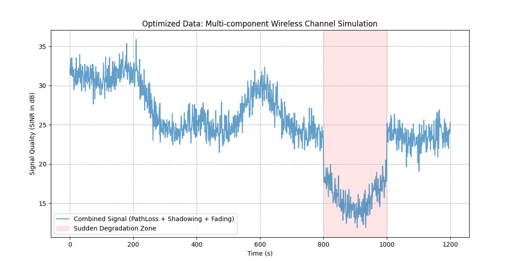
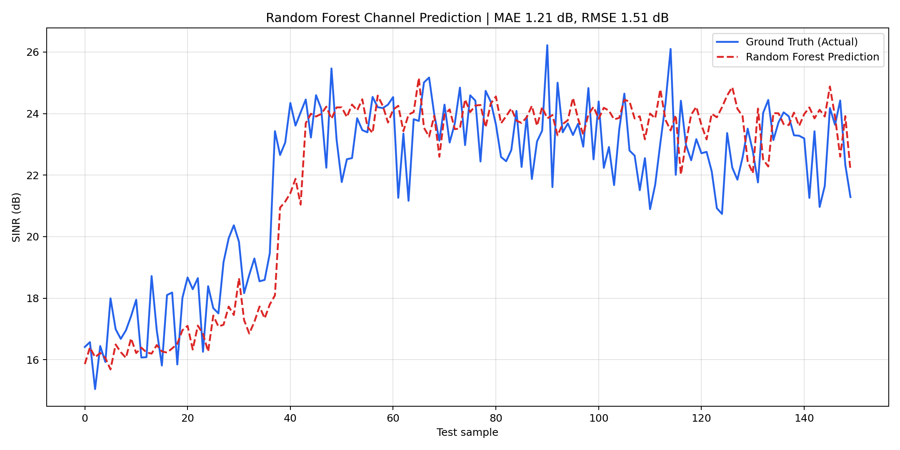
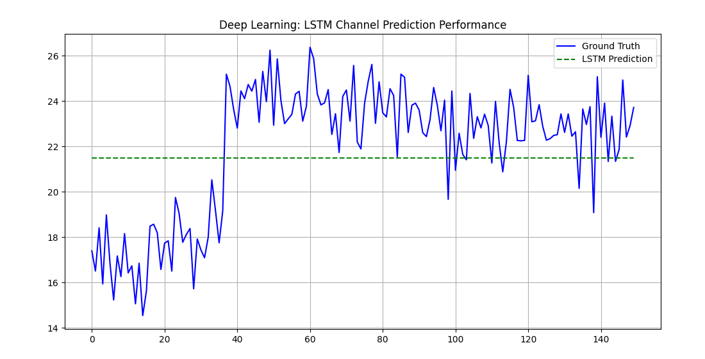
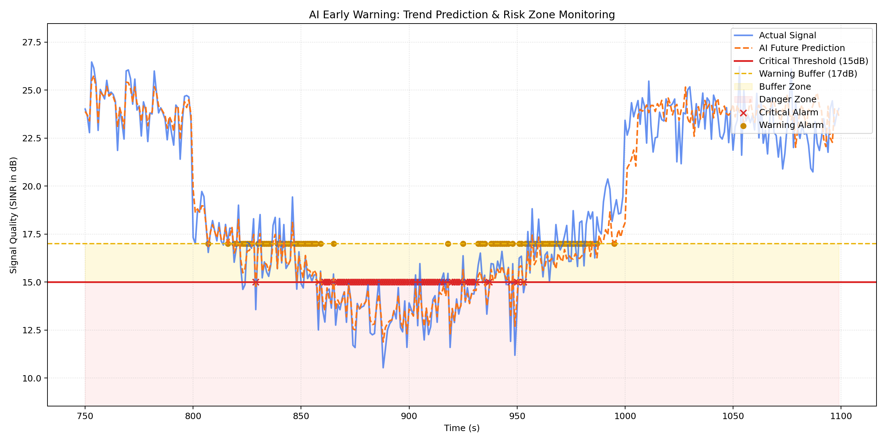

# Wireless Channel Prediction & Early Warning System

[](LICENSE)
[](https://www.python.org/downloads/)
[](https://github.com/wtc2006/Channel_Prediction/releases)
[](https://pytorch.org/)

基于机器学习与深度学习的无线信道质量（SINR）预测与劣化预警系统。项目模拟路径损耗、阴影衰落与快衰落等物理过程，并提供从数据生成、模型训练到智能预警的完整流水线。

## 功能概览

| 模块 | 说明 |
|------|------|
| 数据模拟 | 合成 SINR 时序，含路径损耗、慢衰落、突发事件与瑞利快衰落 |
| 随机森林预测 | 滑动窗口 + 趋势特征，适合快速基线建模 |
| LSTM 预测 | PyTorch 序列模型，捕捉长期信道变化规律 |
| 智能预警 | 基于预测值的临界区 / 缓冲带两级预警 |

## 技术栈

- **数据处理**: NumPy, Pandas
- **机器学习**: Scikit-learn (Random Forest)
- **深度学习**: PyTorch (LSTM)
- **可视化**: Matplotlib

## 快速开始

### 环境要求

- Python 3.8+
- 建议使用虚拟环境

### 安装依赖

```bash
pip install -r requirements.txt
```

### 一键运行全流程

在项目根目录执行：

```bash
python src/main.py
```

在无图形界面的服务器或 CI 环境中，可以使用非交互式绘图后端：

```bash
MPLBACKEND=Agg python src/main.py
```

Windows 控制台若遇到中文或符号输出编码问题，可先设置：

```powershell
$env:PYTHONIOENCODING="utf-8"
python src/main.py
```

流水线将依次完成：

1. 生成模拟信道数据（`channel_data.csv`）
2. 训练随机森林模型（`channel_model.pkl`）
3. 训练 LSTM 模型并输出评估图
4. 运行预警引擎并生成监控图

### 分步运行（可选）

```bash
python src/data_generator.py      # 仅生成数据
python src/model_training.py      # 仅训练随机森林
python src/dl_model_training.py   # 仅训练 LSTM
python src/early_warning.py       # 仅运行预警分析
```

> 运行后会在项目根目录生成 `channel_data.csv`、`channel_model.pkl` 等文件，这些已被 `.gitignore` 忽略，不会提交到仓库。

### 运行测试

```bash
MPLBACKEND=Agg python -m unittest discover -s tests -v
```

## 工程特性

- 使用 `pathlib` 管理项目根目录，脚本可从不同工作目录稳定运行。
- 各模块提供函数入口，既可命令行分步运行，也可被测试或其他项目复用。
- 主流程使用 `subprocess.run(..., check=True)` 串联步骤，任一阶段失败都会立即暴露。
- 随机森林与 LSTM 使用统一随机种子，便于复现实验结果。

## 配置说明

在 [`src/config.py`](src/config.py) 中可调整核心参数：

| 参数 | 默认值 | 含义 |
|------|--------|------|
| `WINDOW_SIZE` | 15 | 滑动窗口长度 |
| `DATA_SIZE` | 1200 | 模拟采样点数 |
| `TEST_SIZE` | 0.2 | 测试集比例 |
| `RANDOM_SEED` | 42 | 随机种子 |
| `CRITICAL_THRESHOLD` | 15 | 严重预警阈值 (dB) |
| `WARNING_BUFFER` | 2 | 预警缓冲带 (dB) |
| `LSTM_EPOCHS` | 100 | LSTM 训练轮数 |

## 项目结构

```text
.
├── .github/workflows/ci.yml  # GitHub Actions 自动验证
├── assets/                   # README 展示用示意图
├── src/
│   ├── config.py             # 全局配置
│   ├── data_generator.py     # 信道数据模拟
│   ├── model_training.py     # 随机森林训练
│   ├── dl_model_training.py  # LSTM 训练
│   ├── early_warning.py      # 预警逻辑
│   └── main.py               # 流水线入口
├── tests/                    # 冒烟测试
├── .gitignore
├── LICENSE                   # MIT 许可证
├── requirements.txt
└── README.md
```

## 可视化展示

### 1. 信道模拟



### 2. 模型表现对比

| Random Forest | LSTM |
| :---: | :---: |
|  |  |

### 3. 智能预警监控



## 工作原理

1. **滑动窗口**：将连续 SINR 序列转为监督学习样本。
2. **趋势特征**：随机森林在窗口基础上增加一阶差分，提升对突变趋势的敏感度。
3. **LSTM 建模**：利用门控结构记忆较长时域上的衰落模式。
4. **分级预警**：预测值低于临界阈值触发严重预警；进入缓冲带则发出普通预警。

## 版本与发布

正式版本见 [GitHub Releases](https://github.com/wtc2006/Channel_Prediction/releases)。

| 版本 | 说明 |
|------|------|
| v1.0.0 | 首个稳定版：数据模拟、RF/LSTM 双模型、预警引擎与文档 |

## 路线图

- [ ] 集成 Transformer 提升长序列预测
- [ ] Web 实时监控看板（Flask / Streamlit）
- [ ] 支持 MIMO 多天线场景

## 许可证

本项目采用 [MIT License](LICENSE)，可自由使用、修改与分发，使用时请保留版权声明。

## 贡献

欢迎通过 Issue 或 Pull Request 参与改进。若本项目对你有帮助，欢迎点个 **Star**。
